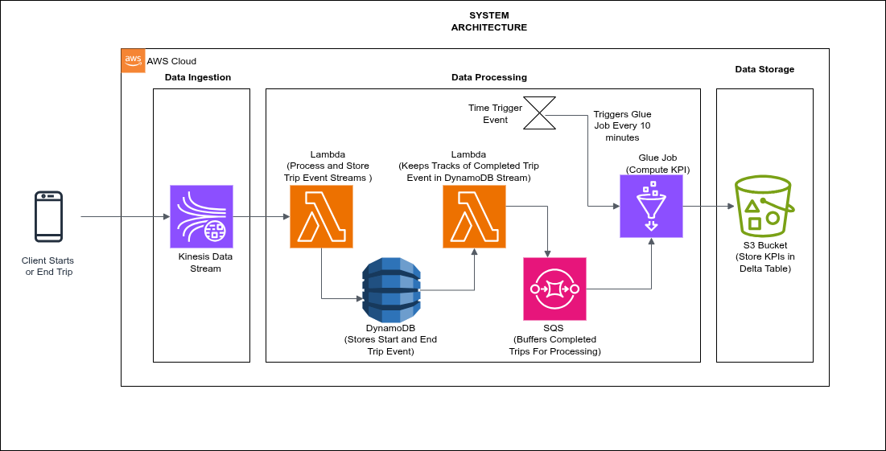

# NSP Bolt Ride – Real-Time Trip Processing Project

**Objective**: 
Design and implement a real-time trip data ingestion and analytics pipeline for a ride-hailing service, simulating a real-world, event-driven architecture using AWS services.

### Project Context
NSP Bolt Ride is a ride-hailing company operating through a mobile app. This project aims to process and enrich trip data in near real time to support analytics and operational monitoring.

The solution demonstrates event-driven data streaming and real-time processing using serverless components.

Data Info:
- Two types of trip events are ingested through Amazon Kinesis:
1. **Trip StartSchema:**

| Field Name                  | Type     | Description                                                  |
|----------------------------|----------|--------------------------------------------------------------|
| `trip_id`                  | string   | Unique identifier for the trip                               |
| `pickup_location_id`       | string   | ID of the pickup location                                     |
| `dropoff_location_id`      | string   | ID of the estimated dropoff location                          |
| `vendor_id`                | string   | ID of the ride vendor (e.g., 1 = Bolt, 2 = Uber)              |
| `pickup_datetime`          | Datetime   | Timestamp when the trip starts (`YYYY-MM-DD HH:MM:SS`)        |
| `estimated_dropoff_datetime` | Datetime | Estimated end time of the trip (`YYYY-MM-DD HH:MM:SS`)        |
| `estimated_fare_amount`    | Decimal   | Estimated fare in local currency (e.g., `"12.50"`)            |
         

2. **Trip End Schema:**


| Field Name         | Type     | Description                                                    |
|--------------------|----------|----------------------------------------------------------------|
| `dropoff_datetime` | Datetime   | Actual time the trip ended (`YYYY-MM-DD HH:MM:SS`)             |
| `rate_code`        | Decimal   | Rate code used for the trip (e.g., standard, night rate, etc.) |
| `passenger_count`  | Int   | Number of passengers                                           |
| `trip_distance`    | Decimal   | Distance traveled in kilometers or miles                       |
| `fare_amount`      | Decimal   | Total fare amount for the trip                                 |
| `tip_amount`       | Decimal   | Amount tipped by the passenger                                 |
| `payment_type`     | Int   | Payment method used (e.g., 1 = Card, 2 = Cash)                 |
| `trip_type`        | Int   | Type of trip (e.g., 1 = Standard, 2 = Shared)                  |
| `trip_id`          | string   | Unique identifier for the trip                                 |

### Daily KPI Aggregation Schema

| Field Name     | Type    | Description                                                                 |
|----------------|---------|-----------------------------------------------------------------------------|
| `pickup_date`  | date    | The day of trip pickup (`YYYY-MM-DD`), used as the partition key            |
| `total_fare`   | Decimal  | Sum of all fares collected from completed trips on that day                 |
| `count_trips`  | Int  | Total number of completed trips on that day                                 |
| `average_fare` | Decimal  | Weighted average fare: `(sum(fare) / count)`                                |
| `max_fare`     | Decimal  | Highest single fare recorded among completed trips                          |
| `min_fare`     | Decimal  | Lowest fare recorded among completed trips                                  |


### AWS Servives Used:
- **Amazon Kinesis**  – Ingests raw trip start and end events
- **AWS Lambda** – Processes Kinesis stream events (validates & stores into DynamoDB)
- **Amazon DynamoDB** – Stores raw trip events and enables change tracking via streams
- **AWS Lambda** – Consumes DynamoDB streams and pushes completed trips into SQS
- **Amazon SQS** – Acts as a buffer for completed trips waiting to be aggregated
- **AWS Glue** – Polls SQS every 10 minutes, aggregates trip data, and performs incremental upserts into Delta Lake
- **Amazon S3**  – Storage layer for Delta Lake (partitioned KPI table)
- **Delta Lake** – Provides ACID-compliant, partitioned storage for daily KPI metrics

### Data Workflow

**1. Event Ingestion:**
Trip data (start and end) is published into Kinesis Data Streams by producers (simulated or mobile clients ).

**2. Kinesis Processing (Lambda #1):**
The stream triggers a Lambda function, which performs:
- Initial validation
- Storage of event records into DynamoDB


**3. DynamoDB Stream Filtering (Lambda #2):**
Changes in the DynamoDB table are streamed via DynamoDB Streams. A Lambda function is triggered by these stream events.
This Lambda function:
- Checks if the event type is a MODIFY operation
- Validates whether the trip record has reached a complete state (both start and end timestamps exist)
- If it's a complete trip, the Lambda serializes the trip data and sends it to the Amazon SQS queue
This design ensures that only completed trips are forwarded for aggregation, reducing downstream noise and improving processing efficiency in AWS Glue.


**4. Aggregation with AWS Glue:**
An AWS Glue job is scheduled to run every 10 minutes to process new trip data.
During each run, the Glue job:
- Polls messages from Amazon SQS (each message represents a completed trip)
- Upserts the aggregated metrics into a Delta Lake table stored in Amazon S3, partitioned by pickup_date
- Deletes processed messages from the SQS queue

### System Architecture



## Project Structure
```
nsp-bolt-ride/
│
├── README.md                      # Project overview and setup instructions
├── requirements.txt               # Python dependencies for local development (if needed)
│
├── .github/
│   └── workflows/
│       ├── deploy-glue.yaml       # CI/CD for Glue Job (ETL)
│       └── deploy-lambda.yaml     # CI/CD for Lambda functions
│
├── src/
│   ├── glue_job/
│   │   └── glue_script/
│   │       └── nsp-bolt-trip-aggregation-job.py   # Glue script for KPI aggregation
│   │
│   ├── lambda/
│   │    ├── bolt_trip_stream_processing/
│   │    │   └── lambda_function.py  # Lambda to process trip events from Kinesis
│   │    │
│   │    └── DDBStreamEvent/
│   │        └── lambda_function.py  # Lambda to filter complete trips from DynamoDB → SQS
│   │
│   └──producer_simulation
│      └── kinesis_producer_simulation.py # Python the simulate as a mobile app for the NSP Bolt Ride (Kineses Producer)
│   
│
│
│── docs/
│
│
└── data/
    └── trip_end.csv
    └── trip_start.csv
```

### Additional Feature:
There is a script that simulate as the mobile app client( that driver start and endind a tip) which produce the data event to the kineses  streams


---

## 🚀 Getting Started

### 🔧 Prerequisites

- Python 3.7+
- AWS CLI installed and configured
- Docker installed (for CI/CD)
- AWS credentials with necessary IAM permissions
- Git installed

### 📥 Clone the Repository

```bash
git clone https://github.com/GEssuman/NSP-Bolt-Ride-Real-Time-Trip-Processing.git
cd NSP-Bolt-Ride-Real-Time-Trip-Processing
```


## CI/CD Deployment with GitHub Actions
This project uses GitHub Actions for automated deployment of:
- AWS Lambda functions
- AWS Glue ETL jobs


**GitHub Secrets**
Ensure the following secrets are configured:
- AWS_ACCESS_KEY_ID
- AWS_SECRET_ACCESS_KEY
- AWS_REGION
- AWS_ACCOUNT_ID


## IAM Roles & Infrastructure Setup
### Lambda Role Permissions
- DynamoDB (Read/Write and Stream access)
- Kinesis (Read)
- SQS (SendMessage)
- CloudWatch Logs

### Glue Job Role Permissions
- SQS (Receive/Delete)
- S3 (Read/Write to Delta Lake)
- CloudWatch Logs


## Required AWS Resources
- Kinesis Data Stream
- DynamoDB Table (with streams enabled)
- SQS Queue
- IAM Roles for Lambda and Glue
- S3 Bucket for Delta Lake output


## Run the Simulation After Infrastructure Set Up
Navigate to the producer script and simulate events:
```
cd src/producer_simulation
python3 kinesis_producer_simulation.py

```
This script reads sample records from the CSV files and sends them to the Kinesis stream.


## Output
Aggregated KPIs are stored in a Delta Lake table on Amazon S3, partitioned by pickup_date. These metrics are suitable for:
- Real-time dashboards
- BI tools (Athena, QuickSight)
- Alerts and operational insights


